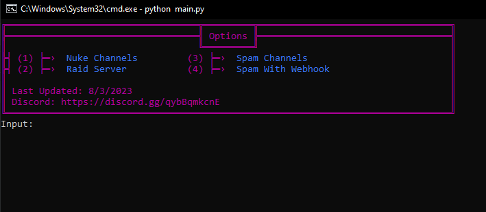

<div id="top"></div>
<p align="center">
  
  
  
  
  
</p>
  
---------------------------------------
   # PLEASE READ:
## This code has some issues, join the discord to buy the full version (cheap)
In addition to that, RS2 Raid tools have been released. They are also available in the discord server, just ask me about it!
<br/>
<div align="center">
  <a href="https://github.com/Jakee8718/RS2-Discord-Server-Nuke-Bot">
    
  </a>
  
  <h2 align="center">Discord Nuke Bot </h3>

  <p>
    <a href="https://discord.gg/qybBqmkcnE">
        </a>
<p>
<p>

  


</p>

  <p align="center">
    Has a user-friendly interface to nuke discord servers with.
  </p>
  </div>
 
<p align="center">
<br />
<br />
Recent update: "Audit Log Spam" is a new feature that allows you to spam the audit log with various things. it's kinda buggy, if it gives any errors just close out and re-open the "run" batchfile again and everything will be back to normal!
    <br />
    <br />
    <a href="https://github.com/Jakee8718/RS2-Discord-Server-Nuke-Bot/issues">Report Bug</a>
    ·
    <a href="https://github.com/Jakee8718/RS2-Discord-Server-Nuke-Bot/issues">Request Feature</a>
  </p>
</div>

<p align="center">

 </p>
</div>


---------------------------------------

### How to use

* Download Python (If needed)
* Open `config.json` and put your bot token inside.
* Then open "run" (double click)
* Now you can use the interface and enjoy!

---------------------------------------

### Features
* Nuke
* Raid
* Free
* Spam
* Webhook Spam
* Audit Log Spam (buggy)
* Doesn't get flagged by Discord

---------------------------------------

### Contact
You can reach me on discord at `daddy_m`
---------------------------------------


### INFORMATION:

```js
Stealing or copying this repositroy in any way is not allowed.
You may NOT redestribute for your own personal benefit (selling, etc)
You may NOT claim that this is yours and you must give credit to the owner (Me)
I am NOT responsible for what you do with this!

Educational Purposes Only.
```
<br />
<br />
<br />
<br />
<br />
<br />
<br />
<br />
<br />
Tags:
discorddiscord-botdiscord-pydmspammermassdiscord-spammer-botdiscord-spammerdiscord-massdmdiscord-mass-dmdiscord-mass-message
discorddiscord-botdiscord-pydmspammermassdiscord-spammer-botdiscord-spammerdiscord-massdmdiscord-mass-dmdiscord-mass-message
discorddiscord-botdiscord-pydmspammermassdiscord-spammer-botdiscord-spammerdiscord-massdmdiscord-mass-dmdiscord-mass-message
discorddiscord-botdiscord-pydmspammermassdiscord-spammer-botdiscord-spammerdiscord-massdmdiscord-mass-dmdiscord-mass-message
discorddiscord-botdiscord-pydmspammermassdiscord-spammer-botdiscord-spammerdiscord-massdmdiscord-mass-dmdiscord-mass-message
discorddiscord-botdiscord-pydmspammermassdiscord-spammer-botdiscord-spammerdiscord-massdmdiscord-mass-dmdiscord-mass-message
discorddiscord-botdiscord-pydmspammermassdiscord-spammer-botdiscord-spammerdiscord-massdmdiscord-mass-dmdiscord-mass-message
discorddiscord-botdiscord-pydmspammermassdiscord-spammer-botdiscord-spammerdiscord-massdmdiscord-mass-dmdiscord-mass-message
